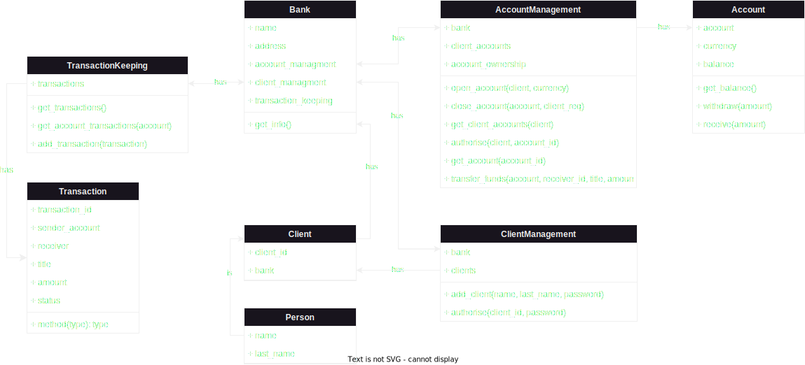

# Banking System in OOP Python

# Table of Contents

1. [Assumptions](#assumptions)
2. [Implementation](#implementation)

# Assumptions

Purpose of this project is to develop author's skills of OOP programing in practice.

There needed to be created following modules:

- run.py
- Bank
- Account
- Person
- Client

In this project there should be used "OOP elements, paradigmats and SOLID rules"
There need to be 5-10 module extentions.

# Implementation

All required modules were implemented. Few modules have been added to extend functionality of a Bank module:

- AccountManagement
- ClientManagement
- Transaction
- TransactionKeeping

## Fig.1 - Architecture of a project

